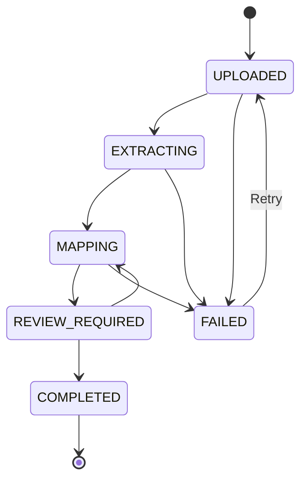

# DataWeave by Groove - System Architecture & Technical Dictionary

## 1. Ubiquitous Language (Dizionario di Sistema)

- **Tenant:** L'azienda cliente (B2B).
- **Groove Admin:** Utente superuser.
- **Tenant User:** Operatore del cliente finale.
- **Document:** Il file PDF caricato.
- **DocumentRow:** Singola riga estratta dall'AI.
- **GlossaryEntry:** Regola di transcodifica del Tenant.
- **Confidence Score:** Valore 0-1 di match.
- **Zero I/O Matcher:** Algoritmo puro di confronto testo-glossario.

## 2. Document State Machine

```
1. UPLOADED -> 2. EXTRACTING -> 3. MAPPING -> 4. REVIEW_REQUIRED -> 5. COMPLETED (o 6. FAILED)
```



## 3. Database Schema (Prisma Blueprint)

- **Model Tenant:** id, name, subscriptionStatus, aiTokenUsage, createdAt
- **Model User:** id, tenantId (FK), role, email, passwordHash
- **Model GlossaryEntry:** id, tenantId (FK), rawSource, mappedTarget, lastUsedAt
- **Model Document:** id, tenantId (FK), status, fileUrl, extractedJson, xmlOutput

> Lo schema Prisma completo è definito in `packages/database/prisma/schema.prisma`.

## 4. Architettura Internazionale (i18n) - DAY 0 POLICY

- **Regola "No Hardcoded Strings":** Utilizzare sempre i namespace di traduzione per la UI. Italiano come default.

## 5. Infrastructure & Docker Deployment

- **Locale (WSL2):** Docker-compose con bind mounts, DB esposto su localhost.
- **Produzione (VM Linux):** Rete isolata, Reverse Proxy (Nginx/Traefik) come entrypoint, container in modalità 'Non-Root', secrets via .env.

## 6. Documentation Lifecycle (Doc-Driven Development)

- I file `.md` sono la **singola sorgente di verità** e vanno aggiornati **PRIMA** di scrivere codice relativo a nuove feature.
